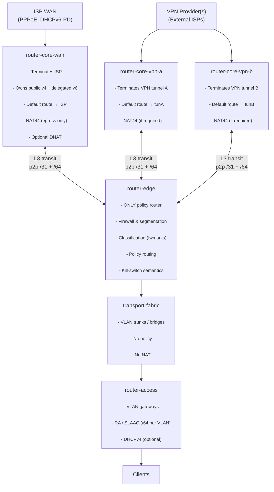

Where 1-core is isp WAN this moment, edge is the polcy router, transport-fabric is my existing routers and switches, and client part doesn't exist yet.:

```mermaid
flowchart TB
    %% ========================
    %% External upstreams
    %% ========================
    ISP["ISP WAN<br/>(PPPoE, DHCPv6-PD)"]
    VPNP["VPN Provider(s)<br/>(External ISPs)"]

    %% ========================
    %% Core routers (termination only)
    %% ========================
    CW["router-core-wan<br/><small>
    - Terminates ISP<br/>
    - Owns public v4 + delegated v6<br/>
    - Default route → ISP<br/>
    - NAT44 (egress only)<br/>
    - Optional DNAT
    </small>"]

    CVA["router-core-vpn-a<br/><small>
    - Terminates VPN tunnel A<br/>
    - Default route → tunA<br/>
    - NAT44 (if required)
    </small>"]

    CVB["router-core-vpn-b<br/><small>
    - Terminates VPN tunnel B<br/>
    - Default route → tunB<br/>
    - NAT44 (if required)
    </small>"]

    %% ========================
    %% Policy router
    %% ========================
    E["router-edge<br/><small>
    - ONLY policy router<br/>
    - Firewall & segmentation<br/>
    - Classification (fwmarks)<br/>
    - Policy routing<br/>
    - Kill-switch semantics
    </small>"]

    %% ========================
    %% Internal transport
    %% ========================
    F["transport-fabric<br/><small>
    - VLAN trunks / bridges<br/>
    - No policy<br/>
    - No NAT
    </small>"]

    %% ========================
    %% Client router
    %% ========================
    A["router-access<br/><small>
    - VLAN gateways<br/>
    - RA / SLAAC (/64 per VLAN)<br/>
    - DHCPv4 (optional)
    </small>"]

    C["Clients"]

    %% ========================
    %% External links
    %% ========================
    ISP --> CW
    VPNP --> CVA
    VPNP --> CVB

    %% ========================
    %% Explicit L3 transit links
    %% ========================
    CW <-->|"L3 transit<br/>p2p /31 + /64"| E
    CVA <-->|"L3 transit<br/>p2p /31 + /64"| E
    CVB <-->|"L3 transit<br/>p2p /31 + /64"| E

    %% ========================
    %% Internal forwarding
    %% ========================
    E --> F
    F --> A
    A --> C
```
