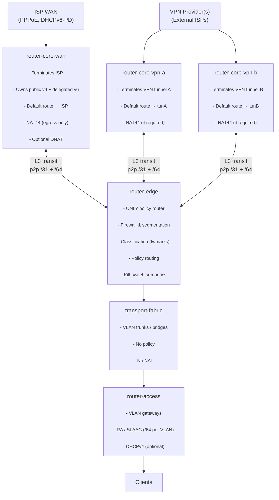

# Router architecture overview

This directory contains a **layered, fully declarative NixOS-based routing architecture** intended to replace traditional “do-everything” firewall appliances (e.g. OPNsense).

The design is based on **strict separation of concerns**:

* each router has exactly **one responsibility**
    
* policy decisions are centralized
    
* translation (NAT) is constrained and explicit
    
* transport is dumb and replaceable
    
* IPv6 is first-class
    

The goal is a system that is:

* auditable (no GUI magic, no hidden state)
    
* evolvable (routers can be replaced independently)
    
* safe by construction (no accidental WAN/VPN fallback, no DNS leaks)
    

* * *

## High-level topology (target state)

* * *

## Design invariants (non-negotiable)

These rules are what make the architecture predictable and debuggable.

### Global

* **Prefixes flow downstream** (core → edge → access)
    
* **Decisions flow upstream** (access → edge only)
    
* **VPN providers are treated as external ISPs**
    
* **IPv6 is first-class** (no NAT66 unless unavoidable and documented)
    
* **IPv4 NAT is explicit, minimal, and constrained**
    
* **No hidden policy state**
    

* * *

## Router roles and contracts

### `router-core-wan`

**Responsibility:** WAN termination only.

Allowed:

* PPPoE, DHCPv6-PD
    
* owning public IPv4 and delegated IPv6 prefixes
    
* default route to ISP
    
* NAT44 on WAN egress
    
* DNAT for inbound services (if required)
    

Forbidden:

* VLANs
    
* firewall policy decisions
    
* policy routing
    
* client-facing services
    

This router is intentionally _boring_.

* * *

### `router-core-vpn-*`

**Responsibility:** VPN tunnel termination only.

Allowed:

* WireGuard/OpenVPN termination
    
* default route into the tunnel
    
* NAT44 only if required by the provider
    

Forbidden:

* traffic classification
    
* client VLAN awareness
    
* firewall policy decisions
    
* fallback logic
    

Each VPN provider gets its **own instance**.  
VPN cores are treated exactly like external ISPs.

* * *

### `router-edge`

**Responsibility:** **the only policy router in the system**.

Allowed:

* firewalling and segmentation
    
* traffic classification (per VLAN, prefix, etc.)
    
* policy routing (WAN vs VPN upstreams)
    
* kill-switch semantics (fail closed)
    
* DNS leak prevention enforcement
    

Forbidden:

* NAT (except explicitly documented IPv4 edge cases)
    
* tunnel termination
    
* WAN ownership
    

If traffic escapes policy, it is a bug **here**.

* * *

### `transport-fabric`

**Responsibility:** packet transport only.

Allowed:

* VLAN trunks
    
* bridges
    
* underlay connectivity
    

Forbidden:

* firewall rules
    
* NAT
    
* routing policy
    

This layer must remain dumb and replaceable.

* * *

### `router-access`

**Responsibility:** client-facing L3.

Allowed:

* VLAN gateways
    
* IPv6 RA / SLAAC (/64 per VLAN)
    
* DHCPv4 for legacy clients
    

Forbidden:

* prefix delegation logic
    
* firewall policy
    
* NAT
    
* upstream selection
    

* * *

## Current state vs target state

**Current:**

* `router-core-wan` and `router-edge` are partially collapsed
    
* `transport-fabric` is implemented by existing routers/switches
    
* `router-access` does not exist yet
    

**Target:**

* all roles separated as documented above
    
* explicit L3 transit links between edge and each upstream
    
* no policy outside `router-edge`
    

This README documents the **target architecture**.  
Temporary deviations during migration must be treated as technical debt and removed.

* * *

## Why this exists

This layout exists to avoid:

* implicit WAN/VPN fallback
    
* NAT being used as a policy primitive
    
* DNS leaks under failure
    
* “it works but nobody knows why” firewall rules
    

Every router here should be independently replaceable without rewriting the rest.

