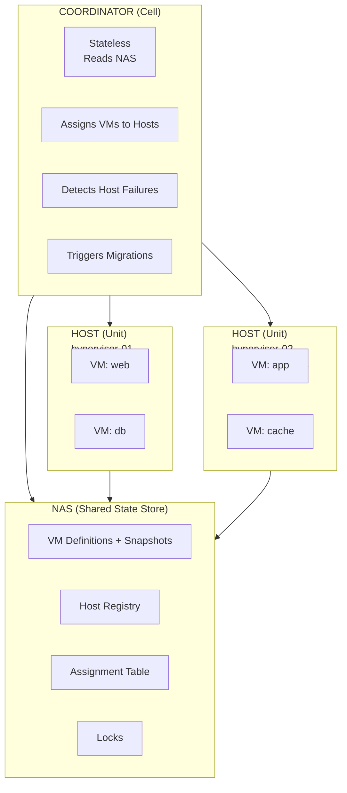

# Overview

```mermaid
flowchart TB
    %% ================================
    %% COORDINATOR
    %% - Compute desired system state
    %% - Assign VMs to hosts
    %% - Detect failures and initiate recovery
    %% - Never executes workloads directly
    %% ================================
    subgraph COORDINATOR["COORDINATOR (Cell)"]
        C1["Stateless\nReads NAS"]
        C2["Assigns VMs to Hosts"]
        C3["Detects Host Failures"]
        C4["Triggers Migrations"]
    end

    %% ================================
    %% HOSTS
    %% ================================
    subgraph HOST1["HOST (Unit)\nhypervisor-01\nState: EXECUTE"]
        H1_VM1["VM: web"]
        H1_VM2["VM: db"]
    end

    subgraph HOST2["HOST (Unit)\nhypervisor-02\nState: EXECUTE"]
        H2_VM1["VM: app"]
        H2_VM2["VM: cache"]
    end

    %% ================================
    %% NAS
    %% ================================
    subgraph NAS["NAS (Shared State Store)"]
        N1["VM Definitions + Snapshots"]
        N2["Host Registry"]
        N3["Assignment Table"]
        N4["Locks"]
    end

    %% ================================
    %% RELATIONSHIPS
    %% ================================
    COORDINATOR --> HOST1
    COORDINATOR --> HOST2
    COORDINATOR --> NAS

    HOST1 --> NAS
    HOST2 --> NAS
```
