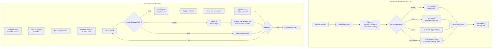

```mermaid
flowchart TD
    subgraph Placement["Coordinator: VM Placement Logic"]
        PL_NEW["New VM defined"] --> PL_HOSTS["Get healthy hosts"]
        PL_HOSTS --> PL_FILTER["Filter by:\n- manifest.constraints\n- resource availability"]

        PL_FILTER --> PL_STRATEGY{"Placement strategy?"}

        PL_STRATEGY -- "spread" --> PL_SPREAD["Pick host with\nfewest VMs"]
        PL_STRATEGY -- "pack" --> PL_PACK["Pick host with\nmost free resources"]
        PL_STRATEGY -- "pinned" --> PL_PIN["Use manifest.pinnedHost"]
        PL_STRATEGY -- "anti-affinity" --> PL_ANTI["Avoid hosts running\nmanifest.antiAffinity VMs"]

        PL_SPREAD --> PL_WRITE["Write assignment"]
        PL_PACK --> PL_WRITE
        PL_PIN --> PL_WRITE
        PL_ANTI --> PL_WRITE

        PL_WRITE --> PL_DONE["Host picks up\non next poll"]
    end

    subgraph Failover["Coordinator: Host Failure"]
        FO_DETECT["Host heartbeat\nmissed > timeout"] --> FO_CONFIRM["Wait 2x timeout\n(avoid flap)"]
        FO_CONFIRM --> FO_MARK["Mark host OFFLINE"]
        FO_MARK --> FO_VMS["List VMs assigned\nto failed host"]

        FO_VMS --> FO_EACH["For each VM"]
        FO_EACH --> FO_POLICY{"manifest.failoverPolicy?"}

        FO_POLICY -- "auto" --> FO_REASSIGN["Reassign to\nhealthy host"]
        FO_POLICY -- "manual" --> FO_ALERT["Alert only,\nno reassign"]
        FO_POLICY -- "none" --> FO_SKIP["Skip (stateless VM)"]

        FO_REASSIGN --> FO_LOCK["Acquire VM lock"]
        FO_LOCK --> FO_WRITE["Write new assignment"]
        FO_WRITE --> FO_NOTIFY["apprise: 'VM X\nfailed over to Y'"]

        FO_ALERT --> FO_NOTIFY_MANUAL["apprise: 'VM X orphaned,\nmanual action needed'"]

        FO_NOTIFY --> FO_NEXT{"More VMs?"}
        FO_NOTIFY_MANUAL --> FO_NEXT
        FO_SKIP --> FO_NEXT
        FO_NEXT -- "Yes" --> FO_EACH
        FO_NEXT -- "No" --> FO_DONE["Failover complete"]
    end
```
