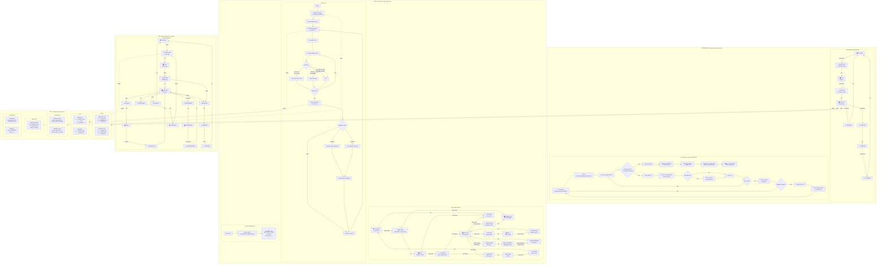

```mermaid
flowchart TD
    %% =====================================================
    %% COORDINATOR (Cell Level)
    %% =====================================================
    subgraph Coordinator["COORDINATOR: vmctl-coordinator.service"]

        subgraph CoordState["Coordinator State Machine"]
            C_STOPPED["⬜ STOPPED"] -->|"cmd: Reset"| C_RESETTING
            C_RESETTING["⚡ RESETTING\nLoad NAS config"] -->|"SC"| C_IDLE
            C_IDLE["🟢 IDLE\nReady"] -->|"cmd: Start"| C_STARTING
            C_STARTING["⚡ STARTING\nConnect to hosts"] -->|"SC"| C_EXECUTE
            C_EXECUTE["🟢 EXECUTE\nMonitoring"] -->|"cmd: Stop"| C_STOPPING
            C_STOPPING["⚡ STOPPING"] -->|"SC"| C_STOPPED
            C_EXECUTE -->|"cmd: Abort"| C_ABORTING
            C_ABORTING["⚡ ABORTING"] -->|"SC"| C_ABORTED
            C_ABORTED["🔴 ABORTED"] -->|"cmd: Clear"| C_CLEARING
            C_CLEARING["⚡ CLEARING"] -->|"SC"| C_STOPPED
        end

        subgraph CoordLogic["Coordinator Logic (in EXECUTE)"]
            CL_LOOP["Poll interval\n(config.coordinatorPollSec)"]

            CL_LOOP --> CL_HOSTS["Read /mnt/nas/private/vmstore/hosts/"]
            CL_HOSTS --> CL_EACH_HOST["For each registered host"]

            CL_EACH_HOST --> CL_HEARTBEAT{"Heartbeat fresh?\n(< config.hostTimeout)"}
            CL_HEARTBEAT -- "Yes" --> CL_HOST_OK["Host ONLINE"]
            CL_HEARTBEAT -- "No" --> CL_HOST_DEAD["Host OFFLINE"]

            CL_HOST_DEAD --> CL_DEAD_ACTION["Mark host OFFLINE\nin NAS registry"]
            CL_DEAD_ACTION --> CL_ORPHAN["Find VMs assigned\nto dead host"]
            CL_ORPHAN --> CL_REASSIGN["Reassign to healthy host\n(write to assignments/)"]
            CL_REASSIGN --> CL_NOTIFY["apprise: 'Host X down,\nVMs reassigned'"]

            CL_HOST_OK --> CL_VM_CHECK["Check VM assignments\nvs actual state"]
            CL_VM_CHECK --> CL_DRIFT{"Drift detected?"}
            CL_DRIFT -- "Yes" --> CL_CORRECT["Write correction\nto assignments/"]
            CL_DRIFT -- "No" --> CL_NEXT["Next host"]
            CL_CORRECT --> CL_NEXT
            CL_NEXT --> CL_MORE{"More hosts?"}
            CL_MORE -- "Yes" --> CL_EACH_HOST
            CL_MORE -- "No" --> CL_PENDING["Check pending\nmigrations"]

            CL_PENDING --> CL_MIG{"Migration needed?"}
            CL_MIG -- "Yes" --> CL_MIG_LOCK["Acquire VM lock"]
            CL_MIG_LOCK --> CL_MIG_WRITE["Write migration order\nto migrations/"]
            CL_MIG -- "No" --> CL_LOOP
            CL_MIG_WRITE --> CL_LOOP
        end
    end

    %% =====================================================
    %% HOST (Unit Level) - State Machine
    %% =====================================================
    subgraph Host["HOST: vmctl.service (per hypervisor)"]

        subgraph HostState["Host State Machine"]
            H_STOPPED["⬜ STOPPED\nHost offline"]
            H_RESETTING["⚡ RESETTING\nMount NAS, load config"]
            H_IDLE["🟢 IDLE\nReady, no VMs"]
            H_STARTING["⚡ STARTING\nBoot assigned VMs"]
            H_EXECUTE["🟢 EXECUTE\nRunning VMs"]
            H_HOLDING["⚡ HOLDING\nPausing VMs"]
            H_HELD["🟡 HELD\nVMs paused"]
            H_UNHOLDING["⚡ UNHOLDING\nResuming VMs"]
            H_SUSPENDING["⚡ SUSPENDING\nNAS lost"]
            H_SUSPENDED["🟡 SUSPENDED\nDegraded mode"]
            H_UNSUSPENDING["⚡ UNSUSPENDING\nNAS back"]
            H_COMPLETING["⚡ COMPLETING\nShutdown VMs"]
            H_COMPLETE["⬜ COMPLETE\nAll VMs stopped"]
            H_STOPPING["⚡ STOPPING\nForce stop"]
            H_ABORTING["⚡ ABORTING\nEmergency"]
            H_ABORTED["🔴 ABORTED\nFailed"]
            H_CLEARING["⚡ CLEARING\nRecovering"]

            H_STOPPED -->|"cmd: Reset"| H_RESETTING
            H_RESETTING -->|"SC"| H_IDLE
            H_IDLE -->|"cmd: Start"| H_STARTING
            H_STARTING -->|"SC: VMs up"| H_EXECUTE
            H_EXECUTE -->|"SC: work done"| H_COMPLETING
            H_COMPLETING -->|"SC"| H_COMPLETE
            H_COMPLETE -->|"cmd: Reset"| H_RESETTING

            H_EXECUTE -->|"cmd: Stop"| H_STOPPING
            H_IDLE -->|"cmd: Stop"| H_STOPPING
            H_STOPPING -->|"SC"| H_STOPPED

            H_EXECUTE -->|"cmd: Hold"| H_HOLDING
            H_HOLDING -->|"SC"| H_HELD
            H_HELD -->|"cmd: Unhold"| H_UNHOLDING
            H_UNHOLDING -->|"SC"| H_EXECUTE

            H_EXECUTE -->|"cmd: Suspend\n(NAS lost)"| H_SUSPENDING
            H_SUSPENDING -->|"SC"| H_SUSPENDED
            H_SUSPENDED -->|"cmd: Unsuspend\n(NAS back)"| H_UNSUSPENDING
            H_UNSUSPENDING -->|"SC"| H_EXECUTE

            H_EXECUTE -->|"cmd: Abort"| H_ABORTING
            H_STARTING -->|"cmd: Abort"| H_ABORTING
            H_ABORTING -->|"SC"| H_ABORTED
            H_ABORTED -->|"cmd: Clear"| H_CLEARING
            H_CLEARING -->|"SC"| H_STOPPED
        end

        subgraph HostLogic["Host Logic"]
            HL_BOOT["Boot"] --> HL_REGISTER["Register in NAS:\nhosts/$HOSTNAME/"]
            HL_REGISTER --> HL_HEARTBEAT["Start heartbeat timer"]
            HL_HEARTBEAT --> HL_READ_ASSIGN["Read assignments/\nfor this host"]
            HL_READ_ASSIGN --> HL_RECONCILE["Reconcile VMs"]

            HL_RECONCILE --> HL_EACH_VM["For each assigned VM"]
            HL_EACH_VM --> HL_VM_STATE{"VM state?"}
            HL_VM_STATE -- "Should run,\nnot running" --> HL_VM_START["Issue VM Reset+Start"]
            HL_VM_STATE -- "Running,\nshould run" --> HL_VM_OK["OK"]
            HL_VM_STATE -- "Running,\nnot assigned" --> HL_VM_STOP["Issue VM Stop"]
            HL_VM_STATE -- "Not running,\nnot assigned" --> HL_VM_OK

            HL_VM_START --> HL_NEXT_VM{"More VMs?"}
            HL_VM_STOP --> HL_NEXT_VM
            HL_VM_OK --> HL_NEXT_VM
            HL_NEXT_VM -- "Yes" --> HL_EACH_VM
            HL_NEXT_VM -- "No" --> HL_CHECK_MIG["Check migrations/\nfor this host"]

            HL_CHECK_MIG --> HL_MIG{"Migration order?"}
            HL_MIG -- "Outbound" --> HL_MIG_OUT["Stop VM, push snapshot"]
            HL_MIG -- "Inbound" --> HL_MIG_IN["Pull snapshot, start VM"]
            HL_MIG -- "None" --> HL_WAIT["Wait for next poll"]
            HL_MIG_OUT --> HL_MIG_ACK["Ack migration complete"]
            HL_MIG_IN --> HL_MIG_ACK
            HL_MIG_ACK --> HL_WAIT
            HL_WAIT --> HL_READ_ASSIGN
        end

        subgraph Heartbeat["vmctl-heartbeat.timer"]
            HB_TICK["Every 30s"] --> HB_WRITE["Write to NAS:\nhosts/$HOSTNAME/heartbeat"]
            HB_WRITE --> HB_CONTENT["{\n  timestamp: now,\n  state: HOST_STATE,\n  vms: [list],\n  resources: {...}\n}"]
        end
    end

    %% =====================================================
    %% VM (Equipment Module Level) - State Machine
    %% =====================================================
    subgraph VM["VM: vmctl-vm@.service (per VM)"]

        subgraph VMState["VM State Machine"]
            V_STOPPED["⬜ STOPPED"]
            V_RESETTING["⚡ RESETTING\nSync disk"]
            V_IDLE["🟢 IDLE\nDisk ready"]
            V_STARTING["⚡ STARTING\nQEMU boot"]
            V_EXECUTE["🟢 EXECUTE\nRunning"]
            V_HOLDING["⚡ HOLDING"]
            V_HELD["🟡 HELD"]
            V_UNHOLDING["⚡ UNHOLDING"]
            V_SUSPENDING["⚡ SUSPENDING"]
            V_SUSPENDED["🟡 SUSPENDED"]
            V_UNSUSPENDING["⚡ UNSUSPENDING"]
            V_COMPLETING["⚡ COMPLETING"]
            V_COMPLETE["⬜ COMPLETE"]
            V_STOPPING["⚡ STOPPING"]
            V_ABORTING["⚡ ABORTING"]
            V_ABORTED["🔴 ABORTED"]
            V_CLEARING["⚡ CLEARING"]

            V_STOPPED -->|"Reset"| V_RESETTING
            V_RESETTING -->|"SC"| V_IDLE
            V_IDLE -->|"Start"| V_STARTING
            V_STARTING -->|"SC"| V_EXECUTE
            V_EXECUTE -->|"SC"| V_COMPLETING
            V_COMPLETING -->|"SC"| V_COMPLETE
            V_COMPLETE -->|"Reset"| V_RESETTING

            V_EXECUTE -->|"Stop"| V_STOPPING
            V_STOPPING -->|"SC"| V_STOPPED

            V_EXECUTE -->|"Hold"| V_HOLDING
            V_HOLDING -->|"SC"| V_HELD
            V_HELD -->|"Unhold"| V_UNHOLDING
            V_UNHOLDING -->|"SC"| V_EXECUTE

            V_EXECUTE -->|"Suspend"| V_SUSPENDING
            V_SUSPENDING -->|"SC"| V_SUSPENDED
            V_SUSPENDED -->|"Unsuspend"| V_UNSUSPENDING
            V_UNSUSPENDING -->|"SC"| V_EXECUTE

            V_EXECUTE -->|"Abort"| V_ABORTING
            V_STARTING -->|"Abort"| V_ABORTING
            V_ABORTING -->|"SC"| V_ABORTED
            V_ABORTED -->|"Clear"| V_CLEARING
            V_CLEARING -->|"SC"| V_STOPPED
        end
    end

    %% =====================================================
    %% NAS DATA STRUCTURE
    %% =====================================================
    subgraph NAS["NAS: /mnt/nas/private/vmstore/"]

        subgraph NAS_Hosts["hosts/"]
            NH1["hypervisor-01/\n├── config.yaml\n├── heartbeat.json\n└── state.json"]
            NH2["hypervisor-02/\n├── config.yaml\n├── heartbeat.json\n└── state.json"]
        end

        subgraph NAS_VMs["vms/"]
            NV1["webserver/\n├── manifest.yaml\n├── .lock\n└── snapshots/"]
            NV2["database/\n├── manifest.yaml\n└── snapshots/"]
        end

        subgraph NAS_Assign["assignments/"]
            NA1["webserver.yaml\n{host: hypervisor-01,\n desired_state: running}"]
            NA2["database.yaml\n{host: hypervisor-01,\n desired_state: running}"]
        end

        subgraph NAS_Mig["migrations/"]
            NM1["webserver.yaml\n{from: hypervisor-01,\n to: hypervisor-02,\n status: pending}"]
        end

        subgraph NAS_Coord["coordinator/"]
            NC1["config.yaml\n{hostTimeout: 120,\n pollInterval: 30}"]
            NC2["state.json\n{state: EXECUTE,\n since: ...}"]
        end
    end

    %% =====================================================
    %% CONNECTIONS
    %% =====================================================
    C_EXECUTE -.->|"reads"| NAS_Hosts
    C_EXECUTE -.->|"reads"| NAS_Assign
    C_EXECUTE -.->|"writes"| NAS_Mig

    HL_REGISTER -.->|"writes"| NAS_Hosts
    HL_READ_ASSIGN -.->|"reads"| NAS_Assign
    HL_CHECK_MIG -.->|"reads"| NAS_Mig

    V_RESETTING -.->|"reads"| NAS_VMs
    V_COMPLETING -.->|"writes"| NAS_VMs
```
