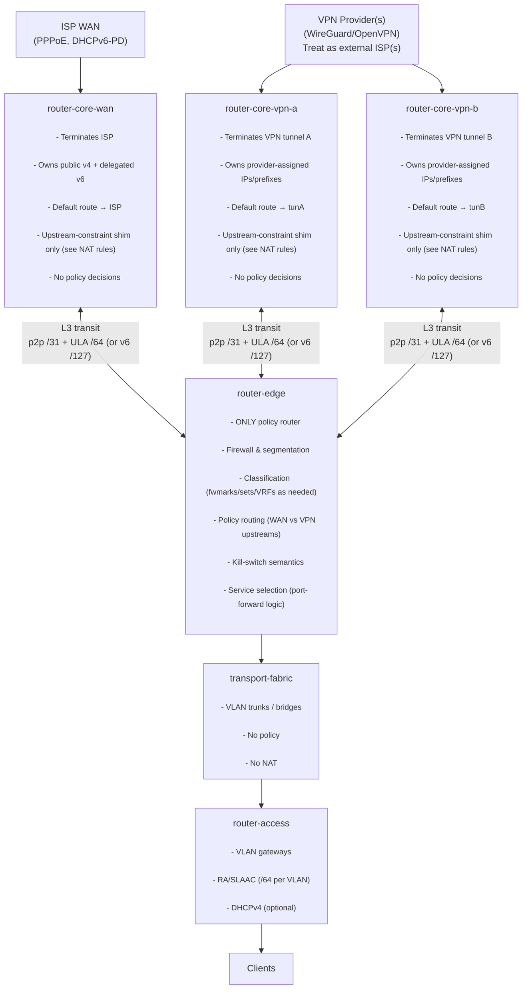
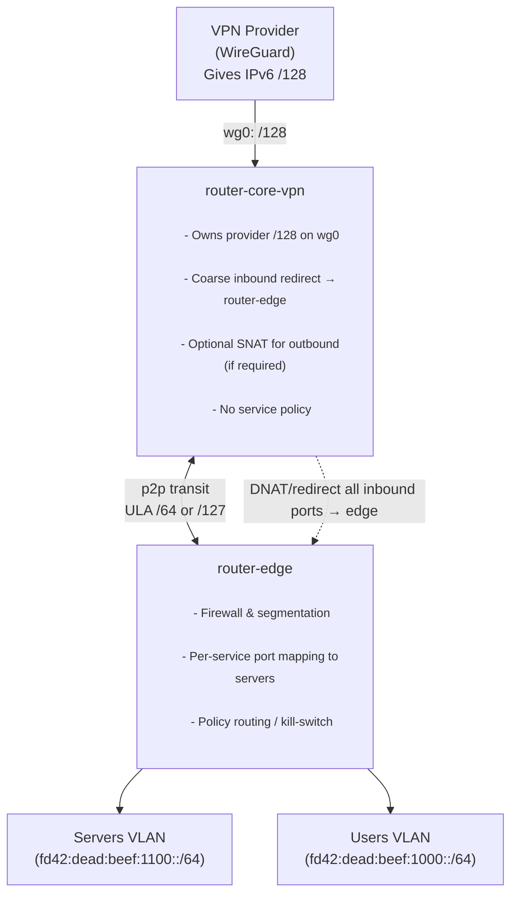
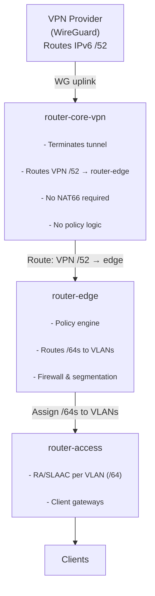

## small note to myself:
For testing purposes, do this on the host, so you can rebuild the container with, without rebuilding ;)

```bash
rsync --delete -va /home/deadbeef/github/nixos s-router-edge:~/github/
nixos-container update s-router-edge-container --flake path:/home/deadbeef/github/nixos/nixos/virtual-machine/nixos-shell-vm/s-router-edge/container#s-router-edge-container && nixos-container root-login s-router-edge-container
```

# VLAN profiles:

| Range | Purpose                  |
| ----- | ------------------------ |
| 10–19 | Management / hypervisors |
| 20–29 | Servers / infra          |
| 30–39 | User LAN                 |
| 40–49 | Work / corp-segmented    |
| 50–59 | IoT / untrusted          |
| 60–69 | DMZ                      |
| 70–79 | Lab / exploit / test     |
| 90–99 | Transit / router links   |
| 1000+ | WAN / ISP / upstream     |


# Router Architecture Overview

This repository documents a **layered, deterministic, IPv6-first routing architecture** used in my environment.

The goal is not abstraction for abstraction’s sake, but **explicit control**, **predictable failure modes**, and **clear responsibility boundaries** between components. The design explicitly accounts for real-world constraints (ISP/VPN limitations, single-address uplinks, NAT) while keeping the system understandable and debuggable.

* * *

## Core Principles

* Each component has **one clearly defined responsibility**
    
* Routing and policy decisions are **explicit and auditable**
    
* **Policy lives in one place** (`router-edge`)
    
* NAT is treated as a **compatibility shim**, never as a design primitive
    
* Internal addressing remains stable regardless of upstream changes
    
* No implicit RA/DHCPv6 “magic” on transit links
    

* * *

## High-Level Topology

> This is the target layering. Core routers terminate upstreams. `router-edge` is the only policy router. Fabric is dumb transport. Access serves clients.



* * *

## Addressing Model

### Internal addressing (stable)

A single ULA block is used for internal infrastructure and VLANs:

```
fd42:dead:beef::/48
```

Example VLAN allocations (/64 per VLAN):

| Segment | Prefix |
| --- | --- |
| Users | `fd42:dead:beef:1000::/64` |
| Servers | `fd42:dead:beef:1100::/64` |
| Lab | `fd42:dead:beef:1200::/64` |
| Infra | `fd42:dead:beef:1300::/64` |

### Inter-router transit links (core ↔ edge)

Transit links are **explicit L3** with **static addressing**:

* IPv6: either `ULA /64` **or** p2p `/127` (both valid; `/127` is cleaner for “p2p-only”)
    
* IPv4: p2p `/31` (preferred) or `/30` (if you want conventional tooling expectations)
    

**RA is disabled** and **DHCPv6 is disabled** on transit links.

* * *

## Policy vs NAT (the rule that prevents spaghetti)

This is the piece that must be unambiguous:

### `router-edge` is the only policy router

Policy includes:

* segmentation and filtering
    
* service exposure decisions (what should be reachable)
    
* policy routing / kill-switch semantics
    
* DNS egress enforcement
    
* per-VLAN/per-host classification
    

### NAT is not “policy”; it is an upstream constraint shim

Some upstreams give you:

* IPv4 `/32`
    
* IPv6 `/128`
    
* or otherwise insufficient routed space
    

In those cases, something must translate/redirect traffic to make multi-host internal networks usable.

**The contract is:**

* **Core routers may perform only the minimum translation/redirect required by the upstream** to hand traffic to `router-edge`.
    
* **All service-level “portforwarding magic” and filtering remains on `router-edge`.**
    

Think of the core’s role (when upstream is single-address) as:

> “Make the uplink usable, then punt everything to the policy engine.”

* * *

## NAT / Redirect Behavior (normative)

### Case A: Upstream provides a routed prefix (ISP / delegated v6, or VPN routed block)

* No NAT needed for IPv6
    
* Core routes the prefix(es) to `router-edge`
    
* `router-edge` may further route to access/VLANs
    

### Case B: Upstream provides a single address (`/32` or `/128`)

* The public `/32` or `/128` **terminates on the core** (it must; that’s the provider adjacency)
    
* The core installs a **coarse inbound redirect** to `router-edge`:
    
    * Either “forward all ports” (DNAT/redirect) to the edge
        
    * Or a small allowed set (if you insist), but the intent is to avoid per-service rules here
        
* `router-edge` performs:
    
    * service selection (per-port/per-service routing to server VLANs)
        
    * firewall policy
        
    * segmentation
        

**Result:** policy stays centralized, while the core remains “dumb” and provider-facing.

* * *

## Example 1: VPN Provider with IPv6 `/128` (single-address uplink)

This example shows the “shim NAT/redirect at core, policy at edge” pattern.



Notes:

* The `/128` is **not** subdivided.
    
* The core can’t avoid owning it, but also shouldn’t become your service firewall.
    
* Edge decides whether `:443` goes to `server-1`, `server-2`, or nowhere.
    

* * *

## Example 2: VPN Provider with a routed IPv6 `/52` (routed-prefix uplink)

Here, the VPN provider gives enough address space to route cleanly. No NAT66 required.



Notes:

* This is the “ideal” model: routing, not translation.
    
* `router-edge` can allocate /64s per VLAN out of the routed `/52`.
    

* * *

## Routing Summary

| Layer | Responsibility |
| --- | --- |
| Core | Upstream termination + _minimum_ shim required by upstream constraints |
| Edge | **All policy**: firewall, segmentation, service selection, PBR |
| Fabric | Transport only |
| Access | Client L3 services (RA/SLAAC, DHCPv4 optional) |

* * *

## Design Rationale

This architecture exists to avoid:

* implicit WAN/VPN fallback
    
* NAT being used as a policy primitive
    
* DNS leaks under failure
    
* “it works but nobody knows why” rule sets
    

It accepts that **perfect IPv6 is not always available** — but constrains the damage:

* internal topology stays stable
    
* policy stays centralized
    
* upstream constraints are handled explicitly as a shim
    
